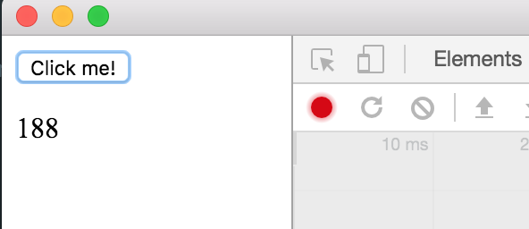
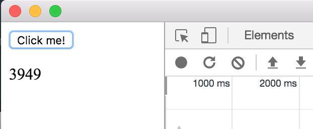

## Prepare
```
npm i
./node_modules/.bin/electron .
```

## Steps
click the button vs. start recording and click the button, check the elapsed ms in the label below the button.

* Run with perf recording  


* Run without perf recording  

